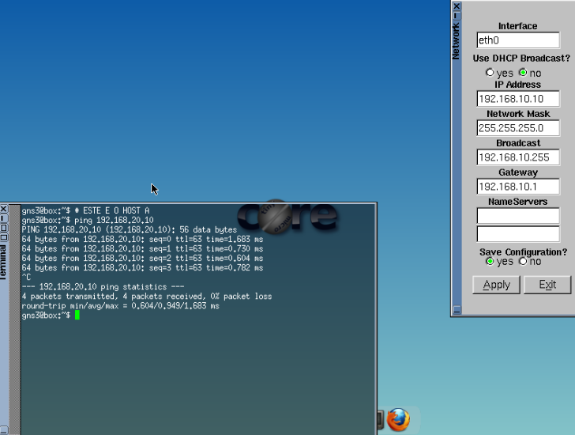
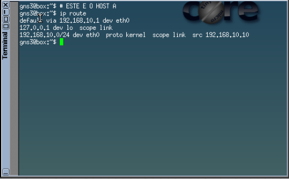
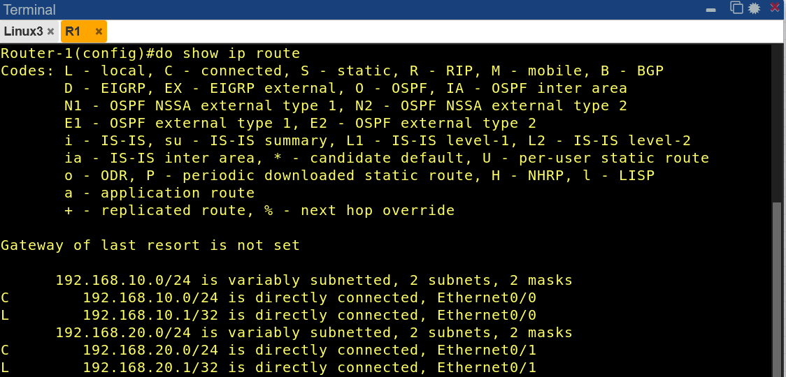

Disciplina: **ENE0011 – Laboratório de Redes**  
Curso: **Engenharia de Redes de Comunicação**  
Instituição: **Universidade de Brasília (UnB)**  
Departamento: **Engenharia Elétrica** 

Professor Responsável: **Prof. Dr. Laerte Peotta de Melo**

# Relatório do Experimento "X"

## Identificação
- Nome: João Victor Machado Santos
- Matrícula: 23201318
- Turma: 01

## Objetivo

Compreender que redes distintas não se comunicam automaticamente, identificar o papel do roteador como elemento lógico de interconexão e diferenciar falha de comunicação por ausência de roteamento de falha física.

## Ambiente experimental

- Cisco IOL
- 2 máquinas linux com a imagem do tinycore

## Procedimentos

Primeiro foram adicionados os Nodes. Em seguida foram utilizados os comandos cisco para configurar os gateways. Comandos utilizados [hostname, interface eth 0/X, ip address 192.168.X.1 255.255.255.0, no shutdown, no ip routing]. Em seguida, foram atríbuidos endereços IP a cada host linux.

X ∈ {10,20}
## Resultados e evidências

  
   
  <em>Figura 1 – Topologia utilizada no experimento com dois hosts e dois gateways Cisco IOL.</em>

Com o Tiny Core foi atribuido um IP à cada host.

  
   
  <em>Figura 2 – Novo Teste de Conectividade.</em>

Utilizando o Host B. Repare na <b>Figura 2</b> que ela pinga seu Gateway porém não pinga o outro Host. Isso se deve ao fato de que mesmo que os dois PCs estejam conectados fisicamente ao mesmo switch ou roteador, eles não conseguem se comunicar diretamente porque pertencem a redes lógicas diferentes.

## Análise técnica

<b>Teste de conectividade SEM roteamento </b>
  -  <b>O enlace físico funciona? O IP está configurado corretamente? </b>
O teste confirmou que o enlace físico e as configurações IP estavam corretos (ping para o gateway funcionou).
- <b>Por que o pacote não chega ao Host B?</b>
A falha entre hosts ocorreu pela ausência de roteamento: o roteador não encaminhava pacotes entre suas interfaces e os hosts não sabiam como alcançar a outra rede.

<b>Teste de conectividade COM roteamento:</b>

Como os Gateways já foram configurados pela GUI do Tiny Linux, bastou habilitar 'ip routing' no Switch L3. Agora o Host A, consegue pingar o Host B.

  
   
  <em>Figura 3: Parte 2 do experimento.</em>

E por fim `ip route`:

  
   
  <em>Figura 2 – ip route no Host A.</em>

No Switch L3:

  
   
  <em>Figura 2 – ip route no Switch L3.</em>

A tabela do Switch L3 (Figura 3) também apresenta apenas rotas diretamente conectadas às interfaces eth 0/0 e 0/1.

- **O roteador conhece o caminho completo?**  
  Não. O roteador conhece apenas o próximo salto (*next hop*) para cada destino.

- **Onde ocorreu a “inteligência” da rede?**  
  No roteador (Switch L3), que ao habilitar `ip routing` passou a encaminhar pacotes entre as redes.

- **O que aconteceria com mais roteadores?**  
  Seria necessário configurar rotas estáticas ou protocolos dinâmicos para que cada roteador aprenda sobre redes não diretamente conectadas.

### Relacionamento explícito com conceitos teóricos

- **Encaminhamento × roteamento**: O roteamento é a construção da tabela (plano de controle); o encaminhamento é a ação de passar o pacote (plano de dados).
- **Plano de dados × plano de controle**: O plano de controle (tabela de rotas) direciona o plano de dados (encaminhamento efetivo dos pacotes).

## Conclusão

O roteador é essencial para interconectar redes, atuando no plano de dados (encaminhamento) e plano de controle (tabela de rotas). A falha inicial foi corretamente identificada como problema de roteamento, não físico.

